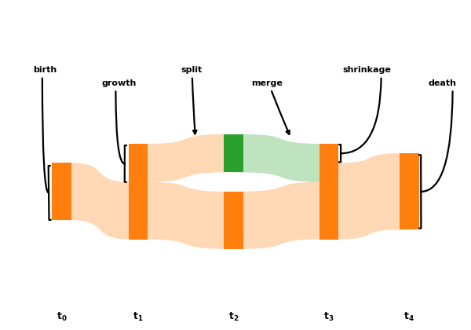

=======
pyAlluv
=======

Package to draw alluvial plots with matplotlib.

    Alluvialdiagram illustrating life-cycle events in a dynamic community.

To get started checkout the `documentation <https://pyalluv.rtfd.io/>`_.

.. inclusion-marker-do-not-remove

Installation
=============

You can get the latest version with

.. code-block:: console

    pip install --upgrade --no-deps git+https://github.com/j-i-l/pyalluv.git
    

Examples
=========

.. exclusion-marker-do-not-remove

See `life_cycle_events.py <examples/life_cycle_events.py>`_

Documentation
==============

http://pyalluv.rtfd.io/
